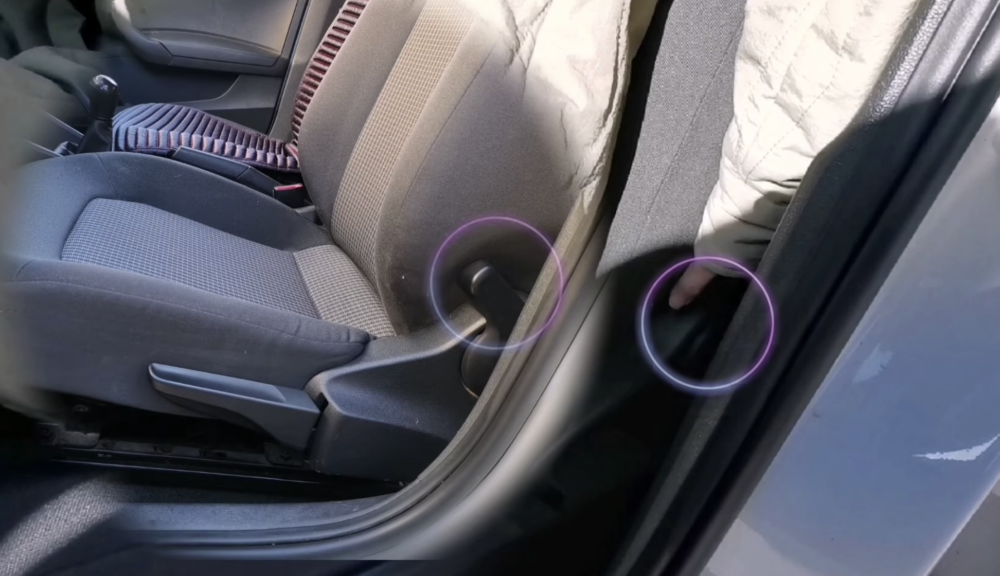
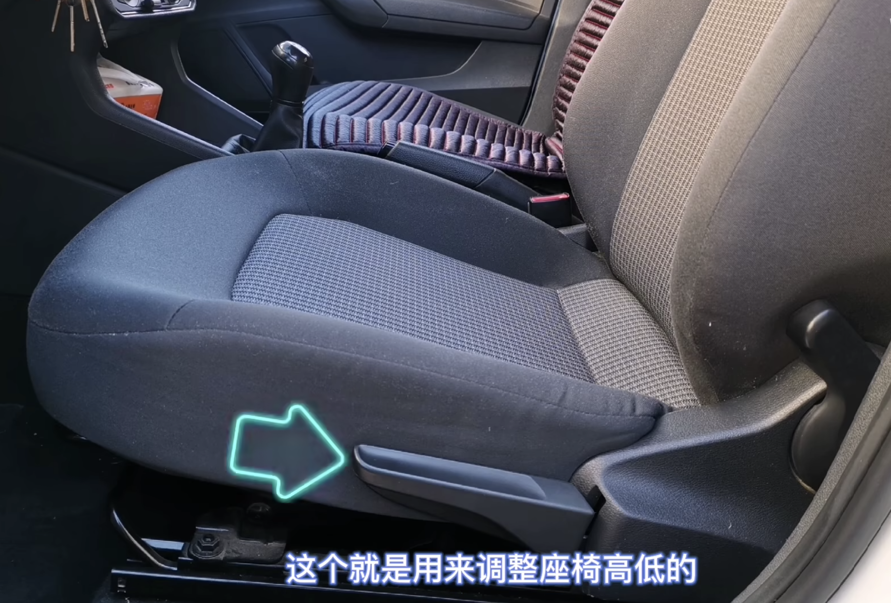
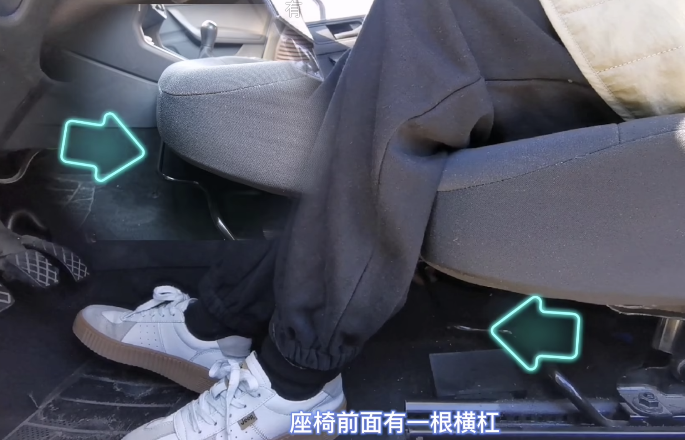
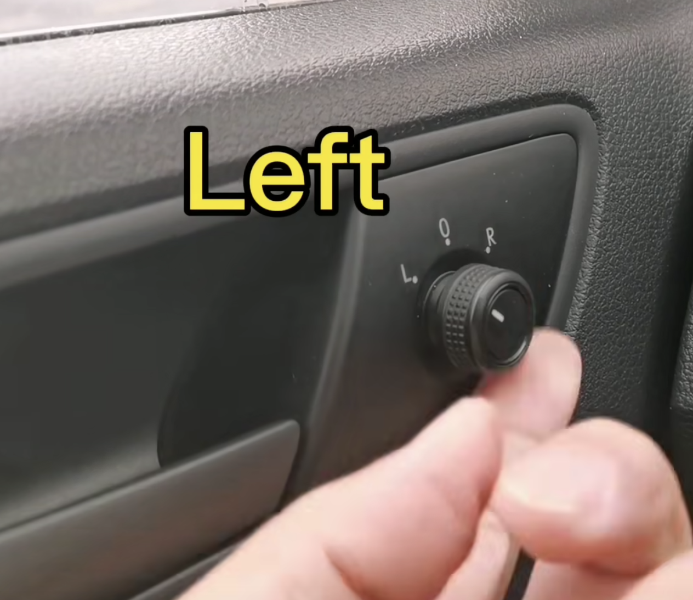
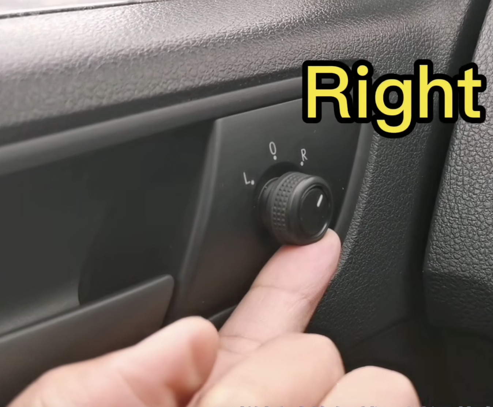
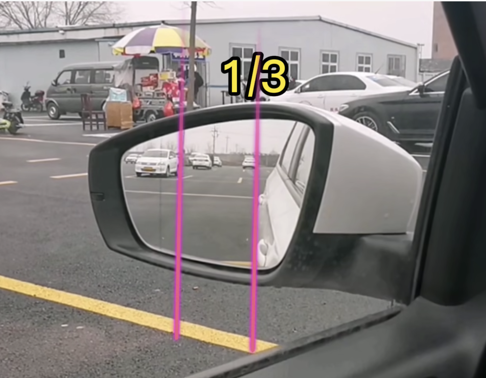
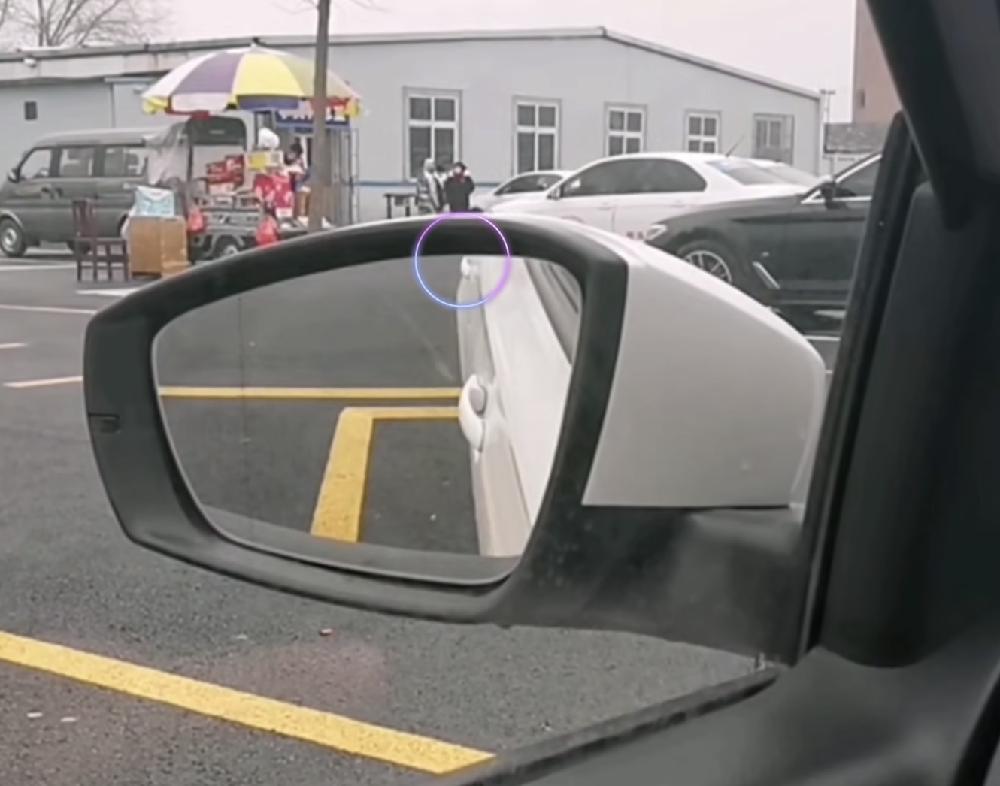

# DriveCar（驾驶车辆）

## 各科目考点
> [科目一](./markdown/科目一.md)   
> [科目二](./markdown/科目二.md)   
> [科目三](./CSS知识点.md)  
> [科目四](./CSS知识点.md)

## 重点
> [离合器原理](./markdown/离合器原理.md)   
> [倒车原理](./CSS知识点.md)

## 疑问 
1. [如何调整座椅的位置？](#tiaozhengzuoyiweizhi)
2. [如何调整后视镜？](#tiaozhenghoushijing)

## 回答

### 如何调整座椅的位置？  [↑](#yiwen)
> 上车前调整座位空间大小  
> 
> 如果不按照顺序调整位置，就会出现重新调整的情况！
> 
> 调整顺序：靠背 > 上下 > 前后  
> 1. 靠背：在靠背左侧有个板杠，通过按动板杠调整靠背倾角，通过身体后仰，从而靠背自动锁死固定位置     
> 2. 上下：在坐垫左侧有个板杠，通过往下拉或往上拉调整座椅高低，调整的标准是头顶离车顶有一拳的距离 
> 3. 前后：在座椅下方有一个横杠，通过提起横杠调整座位前后，调整的标准是以左脚踩离合踩到底舒适受力为准（小腿与大腿形成的夹角大概为45度） 
>

 

### 如何调整后视镜？  [↑](#yiwen)
> 在左侧车门有一个旋钮用来调整后视镜  
> 
> 把旋钮指向L搬动上下左右调整左后视镜，旋钮指向R搬动上下左右调整右后视镜，旋钮指向O两边后视镜都不会动
>  
> 
> 调整顺序：先左右 再上下
> 1. 左右：调整车身占后视镜约 1/3 的位置  
> 2. 上下：把后门把手调至后视镜上沿  
