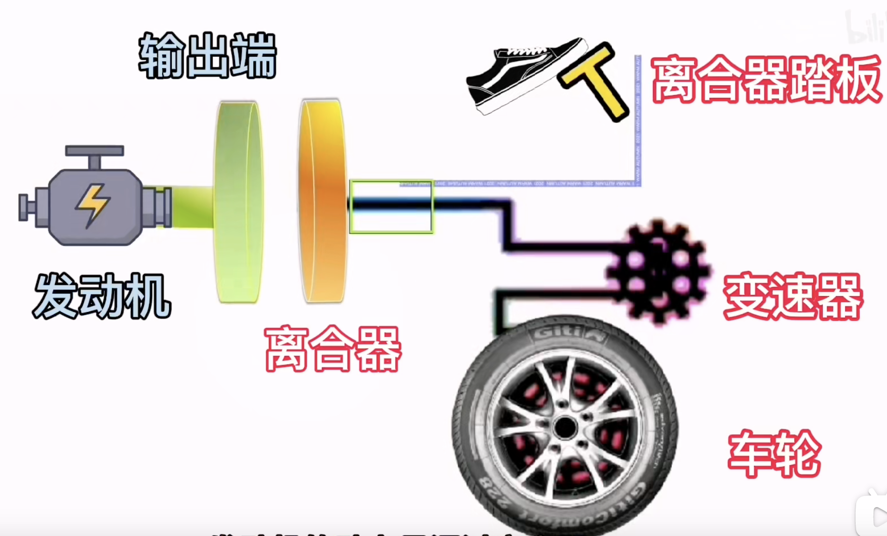

# 科目二

### 离合器原理
> 

> 发动机的动力是通过离合器传到车轮

### 离合器状态
> 
> 离合器-离：踩下离合器踏板，离合器与发动机动力输出端断开，发动机的动力就不会传到车轮，这个时候车轮是没有驱动力的
> 
> 离合器-合：松开离合器踏板，离合器与发动机连接，动力就会传到车轮上，这个时候车轮就有了驱动力
> 
> 离合器-半联动：离合器与发动机输出端并没有达到紧密的贴合状态，离合器靠轻微的摩擦与发动机进行不同步的转动，也就是似离非合的状态

### 离合器的空行程
> 离合器踏板踩到底，在抬起的过程中离合器会向发动机动力输出端移动，在发动机与离合器接触之前，离合器踏板抬起的高度，就是离合器踏板的空行程。在空行程中，不管离合器踏板抬得多快或多慢，车辆都不会动，因为离合器与发动机没有接触。

### 离合踏板位置不变，车速反而变快 ？

> 在半联动状态时，离合器靠摩擦力被发动机动力输出端带动，这时他们是不同步的，但是随着离合器转速的提高，他们相对运动是趋于同步的。这就是离合踏板的位置没有变，车辆不会匀速走，而是越来越快。

### 压离合减速效果不明显 
> 当踩离合器踏板进入空行程，车轮虽然没有了驱动力，但是因为惯性车辆还会保持运动状态，这就是当车速过快，压离合减速效果不明显的原因。所以当车速有快的趋势，就要压离合，不能等车速完全快起来再压。
 
### 车速快的时候，离合踩多少 ？
> 踩多少的目的是让离合进入空行程，踩一丁点让离合进入空行程就行了，这样在车辆阻力增大导致车速下降，需要加速的时候及时抬回来，以保持车速的稳定
> 

### 控速
> 通过踩抬离合踏板，保持离合器断续供给的状态，从而达到控制车速稳定
